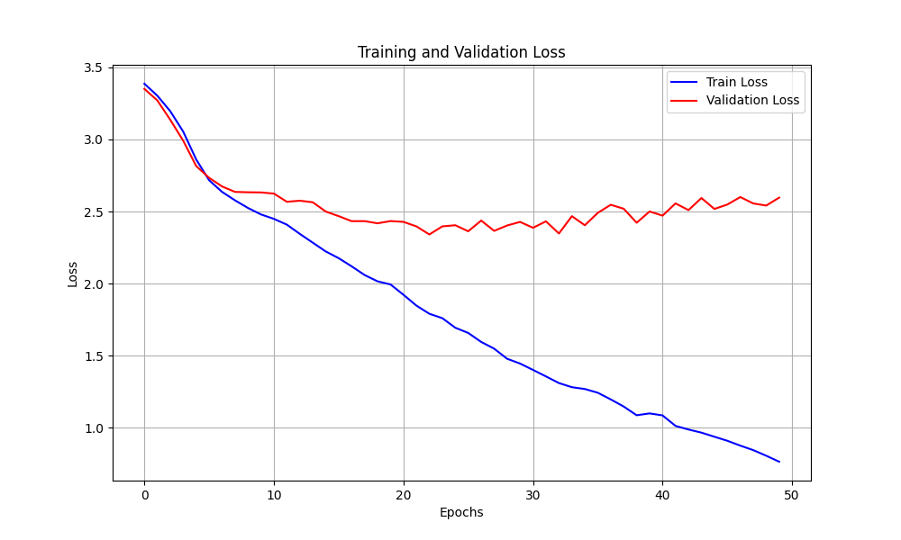
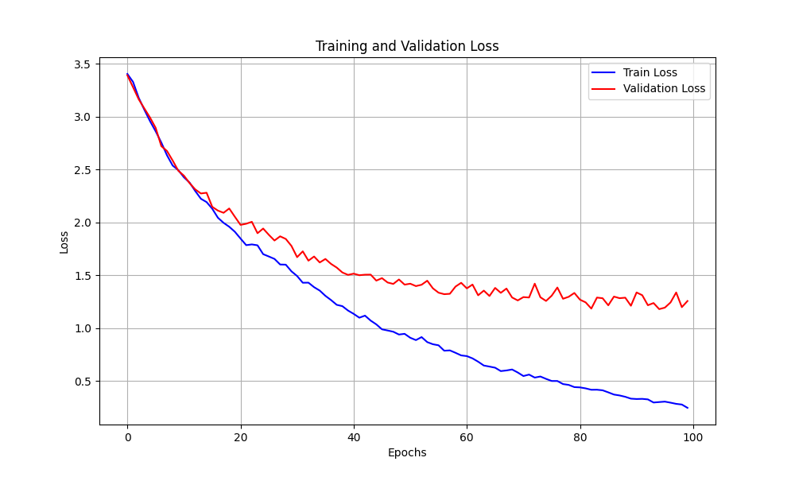
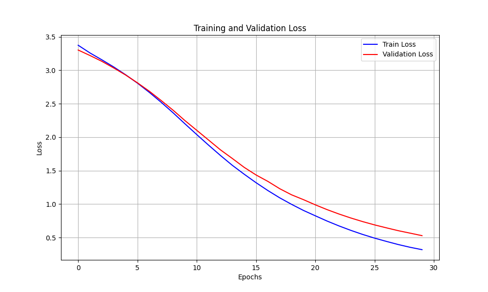

LSTM model for Deduplicated DSUs:
```
SpeakerLSTM(
  (embed): Embedding(2001, 128, padding_idx=2000)
  (lstm): LSTM(128, 128, num_layers=4, batch_first=True, dropout=0.2, bidirectional=True)
  (dropout): Dropout(p=0.2, inplace=False)
  (classifier_layer): Sequential(
    (0): Linear(in_features=256, out_features=128, bias=True)
    (1): Tanh()
    (2): Linear(in_features=128, out_features=64, bias=True)
    (3): Tanh()
    (4): Linear(in_features=64, out_features=32, bias=True)
    (5): Tanh()
    (6): Linear(in_features=32, out_features=30, bias=True)
  )
)
```
Checkpoints locations: 

LibriSpeech: `Speaker-recognition/RNN/artifiacts/model/speaker_lstm_best_LS_DSU_dedup.pth` 

VCTK: `Speaker-recognition/RNN/artifiacts/model/speaker_lstm_best_vctk_dedup_dsu.pth`






Scores:
| Dataset | Accuracy | Precision | Recall | F1 Score |
|---------|----------|-----------|--------|----------|
| VCTK    | 36.60    | 38.13     | 36.60  | 36.77    |
| LS      | 73.58    | 75.22     | 73.58  | 73.48    |


RNN model for continuous features:
```
SpeakerRNN(
  (rnn): RNN(1024, 256, num_layers=3, batch_first=True, bidirectional=True)
  (classifier_layer): Linear(in_features=512, out_features=30, bias=True)
)
```
Checkpoints locations: 

LibriSpeech: `Speaker-recognition/RNN/artifiacts/model/speaker_rnn_LS.pth` 

VCTK: `Speaker-recognition/RNN/artifiacts/model/speaker_rnn_VCTK.pth`




Scores:
| Dataset | Accuracy | Precision | Recall | F1 Score |
|---------|----------|-----------|--------|----------|
| VCTK    | 89.32    | 90.21     | 89.32  | 89.39    |
| LS      | 94.03    | 94.55     | 94.03  | 94.03    |